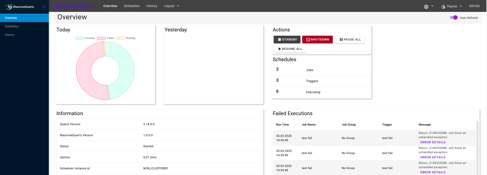

# BlazingQuartz
BlazingQuartz is an easy to use [Blazor](https://blazor.net) web UI to manage [Quartz.NET](https://github.com/quartznet/quartznet) scheduler jobs.

BlazingQuartz is created with [ASP.NET Core Blazor Server](https://blazor.net) and use [MudBlazor](https://mudblazor.com) component library.



## Requirements
* .NET 8
* Quartz 3.8.1+

## Features
* Add, modify jobs and triggers
* Support Cron, Daily, Simple trigger
* Pause, resume, clone scheduled jobs
* Create custom UI to configure job
* [Dynamic variables support](#dynamic-variables)
* Monitor currently executing jobs
* Load custom job DLLs through configuration
* Display job execution logs, state, return message and error message
* Filter execution logs
* Store execution logs into any database
  * Build-in support for SQLite, MSSQL and PostgreSQL
* Auto cleanup of old execution logs
  * Configurable logs retention days
* Build-in Jobs
  * HTTP API client job

## Quick Start
### Using Docker
1. Create the following folders:
   * <blazingquartz_path>
   * <blazingquartz_path>/logs
   * <blazingquartz_path>/certs

2. Copy [BlazingQuartzDb.db](../main/src/BlazingQuartz/BlazingQuartzApp/BlazingQuartzDb.db) to <blazingquartz_path>

3. Run below docker command:
    ```
    docker run -d \
    --name=BlazingQuartzApp \
    -e TZ=<your_timezone> \
    -e ASPNETCORE_HTTP_PORTS=8080 \
    -v /<blazingquartz_path>/BlazingQuartzDb.db:/app/BlazingQuartzDb.db \
    -v /<blazingquartz_path>/logs:/app/logs \
    -v /<blazingquartz_path>/certs:/app/certs \
    -p 9090:8080 \
    wilchn/blazingquartzapp:latest
    ```
    Note: Replace the following:
    - `<blazingquartz_path>`
    - `<your_timezone>` - See list of [acceptable values](https://en.wikipedia.org/wiki/List_of_tz_database_time_zones). Ex. Asia/Singapore 
4. Navigate to http://localhost:9090

## Configuration
### Enable HTTPS
To support https, you will need SSL certificate. Put the SSL certificate file to `<blazingquartz_path>/certs`.
Then add the following lines to appsettings.json:
```json
  "Kestrel": {
  	"Certificates": {
  		"Default": {
  			"Path": "certs/<your_ssl_cert>.pfx",
  			"Password": ""
  		}
  	}
  }
```
NOTE: Replace <your_ssl_cert>

Configure the docker container to use the https port. Ex. https on 9091
```
docker run -d \
...
-p 9090:8080 \
-p 9091:8081 \
-e ASPNETCORE_HTTPS_PORTS=8081 \
wilchn/blazingquartzapp:latest
```
### Use other database
Below steps shows you how to use PostgreSQL database to store execution logs. 

NOTE: Below steps assume that you already created the database and have imported the [DB tables used by Quartz](https://github.com/quartznet/quartznet/tree/main/database/tables). For more info, refer to [configure ADO.NET JobStore](https://www.quartz-scheduler.net/documentation/quartz-3.x/tutorial/job-stores.html#ado-net-job-store-adojobstore). 

1. Copy [appsettings.json](../main/src/BlazingQuartz/BlazingQuartzApp/appsettings.json) to <blazingquartz_path>
2. Modify appsettings.json
   From
   ```
   "ConnectionStrings": {
     "BlazingQuartzDb": "DataSource=BlazingQuartzDb.db;Cache=Shared"
   },
   "Quartz": {
     ...
     "quartz.jobStore.driverDelegateType": "Quartz.Impl.AdoJobStore.SQLiteDelegate, Quartz",
     ...
     "quartz.dataSource.myDS.provider": "SQLite-Microsoft"
   },
   "BlazingQuartz": {
     "DataStoreProvider": "Sqlite",
   ```
   To
   ```
   "ConnectionStrings": {
     "BlazingQuartzDb": "Host=<db_host>;Port=5432;Database=<db_name>;Username=<db_user>;Password=<db_password>"
   },
   "Quartz": {
     ...
     "quartz.jobStore.driverDelegateType": "Quartz.Impl.AdoJobStore.PostgreSQLDelegate, Quartz",
     ...
     "quartz.dataSource.myDS.provider": "Npgsql"
   },
   "BlazingQuartz": {
     "DataStoreProvider": "PostgreSQL",
   ```
   NOTE: Replace below with actual database value:
   - <db_host>
   - <db_name>
   - <db_user>
   - <db_password>
   
   To use MSSQL, change DataStoreProvider to `SqlServer` and update the connection string.
3. Configure the docker container to mount appsettings.json volume. Example docker command:
   ```
    docker run -d \
    --name=BlazingQuartzApp \
    -e TZ=<your_timezone>
    -v /<blazingquartz_path>/appsettings.json:/app/appsettings.json \
    -v /<blazingquartz_path>/logs:/app/logs \
    -v /<blazingquartz_path>/certs:/app/certs \
    -p 9090:80 \
    wilchn/blazingquartzapp:latest
   ```
   NOTE: Replace <blazingquartz_path> and <your_timezone>


## Advance Details

### Dynamic Variables
Dynamic variables provide pre-defined set of variables that can be used when assigning value to `JobDataMap`. Their values are generated at the time of job execution. Any `JobDataMap` field that support `DataMapValueType.InterpolatedString` can use dynamic variable in format ``{{$variable}}``. For example, "list/`{{$datetime 'yyyy-mm-dd'}}`" will be replaced to "list/2022-09-26" during job execution. 

Below are list of pre-defined variables. Note that variable names are case-sensitive.
- `{{$guid}}` - Replace it with a RFC 4122 v4 UUID
- `{{$datetime rfc1123|iso8601|"custom format"|'custom format' [offset unit]}}` - Replace it with a UTC datetime string in either ISO8601, RFC1123 or a custom display format. You can also specify an offset relative to current date time. For example, `{{datetime iso8601 -1 d}}` to represent one day ago.
- `{{$localDatetime rfc1123|iso8601|"custom format"|'custom format' [offset unit]}}` - Similar to `$datetime` except it returns local date time.

`$datetime` and `$localDatetime` supports below offset units:
Unit   | Description
-------|------------
y      | Year
M      | Month
d      | Day
h      | Hour
m      | Minute
s      | Second
ms     | Millisecond

## Upgrading

Refer to [upgrading page](docs/Upgrading.md) to see if any additional steps require to upgrade to newer version.